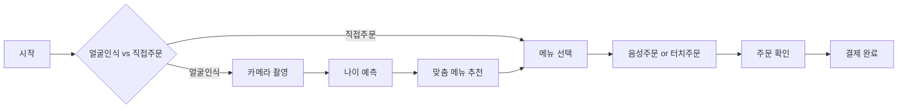

# 🍔 Intelligent Kiosk System
### 시각장애인을 위한 지능형 키오스크


- 🎨 **UX 전략 디렉터** 역할
- 🤝 **디자인-개발-기획 통합** 관리


### 💡 의의
- ♿ **사회적 가치** 실현
- 🤖 **AI 기술 실무** 적용
- 🎓 **문제 해결** 능력 개발
- 📊 **프로젝트 관리** 경험


---

## 🚀 주요 기능

### 🟢 완전 구현된 기능


🎤 음성 인식 시스템 - 자연어 주문 처리

- **Google Speech Recognition API** 활용
- **미리 녹음된 음성 안내** (voice.mp3)
- **12가지 메뉴** 음성 인식 지원
- **세트/단품** 구분 주문

```python
def listen_for_order(self):
    """음성 주문 처리"""
    self.play_voice_prompt()  # "주문을 말해주세요"
    # "빅맥세트 주세요" → 자동 주문 추가
```


👁️ 얼굴 인식 & 나이 예측 - 개인화 추천

- **OpenCV DNN 모델** 사용
- **8개 연령대** 분류
- **맞춤형 메뉴** 추천
- **연령별 폰트 크기** 조절

```python
AGE_RECOMMENDATIONS = {
    "(15~20)": "상하이버거세트",
    "(25~32)": "빅맥세트",
    "(48~53)": "쿼터파운더치즈"
}
```


🛒 스마트 주문 관리 - 실시간 주문 처리

- ✅ 실시간 주문 추가/제거
- ✅ 총 금액 자동 계산
- ✅ Excel 영수증 저장
- ✅ 12가지 햄버거 메뉴


### 🟡 부분 구현된 기능

| 기능 | 상태 | 설명 |
|------|------|------|
| 🖥️ **키오스크 모드** | ⚠️ 70% | 전체화면, 자동 초기화 완료 |
| 🔧 **에러 처리** | ⚠️ 50% | 기본적인 예외 처리만 구현 |

### 🔴 미구현 기능 (아이디어 단계)

| 기능 | 이유 | 대안 |
|------|------|------|
| 🔤 **점자 지원** | 하드웨어 부족 | TTS로 대체 |
| ⌨️ **키보드 네비게이션** | 시간 부족 | 향후 개발 예정 |
| 🔒 **보안 강화** | 프로토타입 수준 | 상용화 시 필요 |

---

## 📊 완성도 현황


| 영역 | 진행률 | 상태 |
|:----:|:------:|:----:|
| 🎤 **음성 인식** | *


---

## 🛠️ 기술 스택


### 🤖 AI & Machine Learning

- 🎤 **마이크** (음성인식) 
- 🔊 **스피커** (음성출력)


#### 💻 소프트웨어
- 🐍 **Python 3.7-3.9**
- 📦 **pip 패키지 관리자**
- 🌐 **인터넷 연결** (모델 다운로드)


### 📥 설치 및 실행

```bash
# 1️⃣ 저장소 클론
git clone https://github.com/SUNWOOKLEE04/Intelligent-Kiosk-System.git
cd Intelligent-Kiosk-System

# 2️⃣ 패키지 설치
pip install -r requirements.txt

# 3️⃣ AI 모델 다운로드 (필수!)
# 👇 아래 가이드 참고

# 4️⃣ 실행
python src/main_app.py
```

### 🤖 AI 모델 다운로드

> ⚠️ **중요**: GitHub 용량 제한으로 AI 모델은 별도 다운로드가 필요합니다.


📥 모델 파일 다운로드 가이드

#### 1. 나이 예측 모델 (44MB)
```bash
# Google Drive에서 다운로드
```
🔗 [age_net.caffemodel 다운로드](https://drive.google.com/file/d/1Dm1X21ER0HsaF3RNYcNczNS-QpO8Q1k2/view?usp=sharing)

**→ `models/age_net.caffemodel`에 저장**

#### 2. 얼굴 검출 모델 (2.7MB)
```bash
cd models

# Windows
Invoke-WebRequest -Uri "https://github.com/opencv/opencv_3rdparty/raw/19512b876c2a5b8c0c1e7e69ad6339f2a9bb8095/opencv_face_detector_uint8.pb" -OutFile "opencv_face_detector_uint8.pb"

# Mac/Linux  
wget https://github.com/opencv/opencv_3rdparty/raw/19512b876c2a5b8c0c1e7e69ad6339f2a9bb8095/opencv_face_detector_uint8.pb
```

#### 📂 최종 확인
```
models/
├── ✅ opencv_face_detector.pbtxt (포함됨)
├── ❌ opencv_face_detector_uint8.pb (다운로드 필요)
├── ✅ age_deploy.prototxt (포함됨)  
└── ❌ age_net.caffemodel (다운로드 필요)
```


---

## 🎮 사용 방법

### 🎯 기본 사용 흐름



### 📱 주요 기능 사용법


🎯 얼굴 인식으로 맞춤 추천 받기

1. **"얼굴 인식으로 시작"** 버튼 클릭
2. 카메라 앞에서 **스페이스바** 누르거나 자동 촬영 대기
3. 연령대별 **맞춤 메뉴 추천** 확인
4. **"메뉴 보기"** 버튼으로 주문 진행


🎤 음성으로 주문하기

1. 메뉴 화면에서 **"🎤 음성으로 주문하기"** 클릭
2. "주문을 말해주세요" 안내 후 **2초 대기**
3. **"빅맥세트 주세요"** 같은 자연어로 주문
4. 음성 인식 결과 확인 후 주문 추가


---

## ⚠️ 중요 안내사항

### 🚨 제한사항


| ⚠️ **이 프로젝트는 2021년 고등학교 해커톤 프로토타입입니다** |
|:---:|


- 🔧 **현재 환경 작동 미확인** - 패키지 버전 충돌 가능
- ♿ **완전한 접근성 미지원** - TTS만 구현, 점자 등 미완성
- 🏪 **상용 서비스 부적합** - 보안, 안정성 부족
- 🐛 **알려진 버그** - 장시간 실행 시 메모리 누수 등

### 🔧 자주 발생하는 문제


💡 문제 해결 가이드

#### 🎥 카메라 권한 오류
```bash
# 해결: 시스템 설정에서 카메라 권한 허용
```

#### 🎤 마이크 권한 오류
```bash
# 해결: 시스템 설정에서 마이크 권한 허용
```

#### 📦 모듈 import 오류
```bash
pip install --upgrade -r requirements.txt
```

#### 🤖 OpenCV 오류
```bash
pip uninstall opencv-python
pip install opencv-python==4.8.1.78
```


> 💬 **문제가 해결되지 않으면**: [Issues](https://github.com/SUNWOOKLEE04/Intelligent-Kiosk-System/issues)에 문제를 신고해주세요!

---

## 🎓 학습 가치

### 📚 배울 수 있는 것들


#### 🤖 AI 기술
- OpenCV 얼굴인식
- 음성인식 API 활용
- 머신러닝 모델 통합


#### 💻 개발 기술
- Python GUI 개발
- 모듈화된 코드 설계
- 외부 API 연동


#### 🎨 UX 설계
- 접근성 고려 설계
- 사용자 중심 인터페이스
- 프로토타입 개발


---

## 🤝 기여하기

### 💡 활용 권장 분야


| ✅ 추천 | ❌ 비추천 |
|:------:|:--------:|
| 🎓 **학습/교육 목적** | 🏪 **실제 매장 운영** |
| 🔬 **연구 프로젝트** | ♿ **실제 접근성 서비스** |
| 🛠️ **프로토타입 베이스** | 💰 **상업적 목적** |
| 📚 **포트폴리오 참고** | 🔒 **보안이 중요한 환경** |


### 🔧 개선 아이디어

이 프로젝트를 **fork**해서 다음과 같이 발전시켜보세요!

- [ ] 🔤 **완전한 점자 지원** 구현
- [ ] 🌍 **다국어 음성인식** 추가  
- [ ] 📱 **모바일 버전** 개발
- [ ] 🔒 **보안 강화** 및 **에러 처리** 개선
- [ ] 🧪 **단위 테스트** 코드 작성
- [ ] 🎨 **더 나은 UI/UX** 디자인

---

## 📞 연락처


[![GitHub](https://img.shields.io/badge/GitHub-SUNWOOKLEE04-181717?style=forUNWOOKLEE 인사


### 🎯 솔직한 이야기

> **"2021년 고등학생이 만든 첫 AI 프로젝트입니다"**


#### ✨ 자랑스러운 점
- 🏆 실제 해커톤 수상작
- 🤖 AI 기술 실무 적용 경험  
- ♿ 사회적 가치 실현 시도
- 👥 팀 리더십 경험


#### 🔧 아쉬운 점  
- 💻 고등학생 수준의 코드 품질
- 🧪 현재 환경 작동 미확인
- 🎯 일부 기능 미완성
- 📚 문서화 부족


### 🚀 앞으로의 바람

```
완벽하지 않지만, 진심이 담긴 프로젝트입니다.
필요하시면 가져가서 더 발전시켜 주세요!

배우고 싶은 기술이 있다면 참고용으로 활용하세요.
문제가 있으면 Issues에 남겨주시면 최대한 도움드릴게요!
```

### ⭐ 이 프로젝트가 도움이 되었다면 Star를 눌러주세요!

*"완벽하지 않아도 시작하는 용기가 중요합니다"*  
**- 2021년 고등학생 개발자 -**


---


![Footer](https://img.shields.io/badge/Made%20with-❤️%20%26%20☕-red?style
